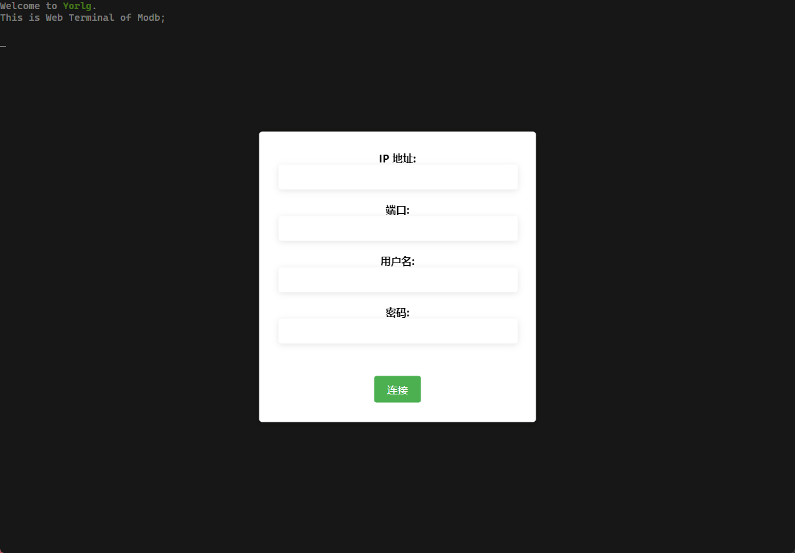
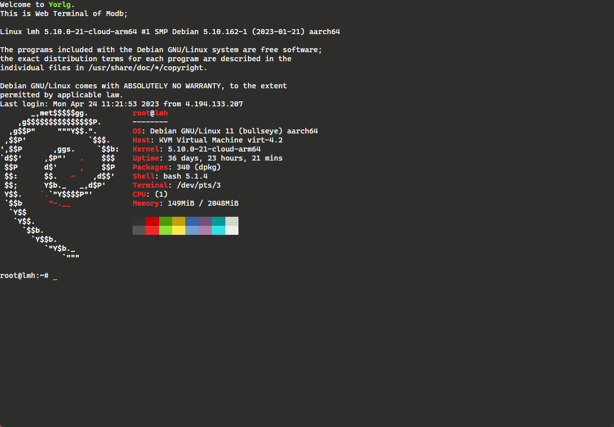
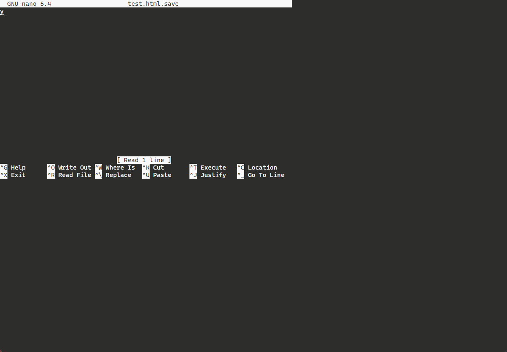

# WebSSH

这是一个基于Web的终端仿真器和SSH客户端的示例，使用Express框架搭建服务器，并使用SSH2代理到SSH服务器的Websocket连接。

## 示例图

## 功能
- [x] 支持IP登录
- [ ] 支持地址栏传参进行登录
- [ ] 后期规划是否需要支持密钥登录
- [ ] 支持多tab窗口模型，可以随时开启和关闭多个会话窗口
- [x] 可以保存主机连接信息
- [x] 支持vim,mc,irssi,vifm,top语法
- [x] 支持复制和粘贴操作
- [x] 窗口自适应
- [ ] 操作录像
- [x] 心跳重连

## 环境
Node >= 14

## 启动
下载依赖
`npm install`

启动程序
`node server/app`

访问：`http://127.0.0.1:3000`
